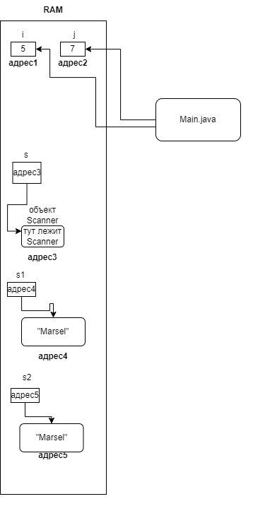

# Классы и объекты

## 00. Примитивные и ссылочные типы

* Тип данных (примитивный тип данных) - `int`, `boolean`, `char` и т.д.
* Переменные примитивных типов хранят в себе непосредственно значения
* `RAM` - (Raw Access memory) - оперативная память, позволяет быстро запоминать
* какую-либо информацию и быстро к ней получать доступ
* Есть постоянная память, но она работает медленно (но у нее больший объем и она всегда помнит информацию)
* У каждой переменной есть свой адрес (но мы его не видим)
* `Объявление переменной` - процесс, когда мы пишем в первый раз название переменной и указываем ее тип.
* Делаем это для того, чтобы дальше пользоваться этой переменной.

* Ссылочные типы (их можно сразу узнать по тому, что они начинаются с большой буквы и есть оператор `new`)
* `new Scanner` - такая запись создала новый `объект`, у этого объекта есть свой адрес
* Переменная ссылочного типа не хранит в себе значение, она хранит в себе ссылку (адрес) на объект.
* `String` - это строка, тоже ссылочный тип.


## 01. Сравнение строк

```
String s1 = new String("Marsel");
String s2 = new String("Marsel");

System.out.println(s1 == s2); // false
```

* Если мы создаем строки через оператор `new`, то имеем следующую ситуацию:
    * Переменная `s1` содержит адрес строки `Marsel` (адрес X)
    * Переменная `s2` содержит адрес другой строки `Marsel` (адрес Y)
    * Когда мы сравниваем строки через `==` мы сравниваем значения переменных `s1` и `s2`
    * А значения этих переменных - это адреса разных объектов, поэтому получаем `false`
    * Так работает с ссылочными типами

* Если бы у нас были `int` (примитивные):

```
int i = 5;
int j = 5;

System.out.println(i == j); // true
```

* Тут мы сравниваем значения переменных `i` и `j`, а их значения одинаковые и равны `5`

## 02. Классы

* Ссылочные типы делятся на две категории - массивы и классы.


* Класс - "шаблон" для построения объектов, т.е. какой-то "чертеж", на основе которого мы будем создавать конкретные экземпляры.
* `String s = new ("Hello");` - мы на основе класса `String` создали объект-строку "Hello" и положили адрес этой строки в объектную переменную `s`
* `Объектная переменная` - обычная переменная, но ссылочного типа.
* Классы, в первую очередь, используются для того, чтобы сгруппировать переменные разных типов в один объект.
* Такие переменные, описанные внутри класса, называются полями (`field`)
* У каждого объекта (экземпляра класса) значения этих полей - свои.
* Помимо того, что класс содержит какую-либо информацию, он может содержать так называемые "методы"
* Методы - это определенные инструкции (подпрограммы), которые можно вызывать из объектов, и они что-то будут делать.


### Пример написания собственного класса

```
public class Human {
    String name;

    int age;
}
```

## Резюме

* Примитивные типы (хранят непосредственно значение) - `int`, `long`, `short` и т.д.
* При их сравнении сравниваются непосредственно их значения, которые содержат число или что-то еще

* Ссылочные типы (хранят адрес объекта) - `String`, `Scanner`, `Random` и т.д.
* При их сравнении тоже сравниваются их значения, просто в качестве значения выступает адрес объекта.

* Классы (тип) - это некоторые шаблоны, на основе которых строятся объекты.
* Объект - конкретный экземпляр класса.
* На объект указывает переменная ссылочного типа (которая имеет тип класса, например `Human h`), называемая объектной переменной.
* Класс может состоять из полей и методов.
* У каждого объекта свои значения полей.
* Если мы вызываем метод через какой-то объект, то он работает с полями этого объекта
* Итого, классы - это мощный механизм для реализации какого-либо функционала.
* Мы уже пользуемся встроенными классами (например `Scanner`, у которого тоже есть куча полей и методов) `nextLine()`
* Методы и поля у класса называются членами класса (`class members`) к ним обращаемся через оператор `.` после названия объектной переменной

## Словарик

* `Data types` - типы данных
* `Reference type ` - ссылочный тип
* `Variable` - переменная
* `Undefined` - не определено (такое понятие используется к переменным, в которых ничего нет)
* `Field` - поле
* `Method` - метод
* `Subprograms` - подпрограммы
